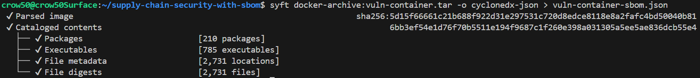
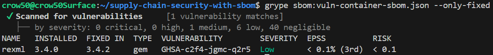
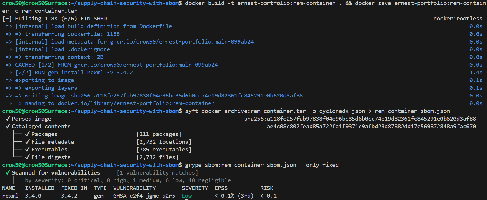
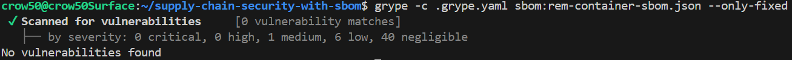

# Supply Chain Security with SBOM

## What is an SBOM?

A Software Bill of Materials, or SBOM, is an inventory of all components, libraries, and module dependencies that are used in an application. This inventory is essential in understanding our software supply chain allowing us to secure our application by identifying vulnerabilities and managing risks associated with third-party components.

We can think of an SBOM as a nutrition label and our container as the TV Dinner. While it may just be spaghetti and meatballs, there are many ingredients that go into making that meal and an SBOM will tell us about each individual ingredient. 

For example, if there is a recall or warning on a specific ingredient, we can quickly identify if our meal is affected and gain insight into the severity or remediation steps. Similarly, if a vulnerability is discovered in a library or package that our application depends on, an SBOM allows us to quickly identify if our application is affected and take appropriate action.

For our use case, we will be using Syft to generate an SBOM for our containerized Ruby Jekyll application and Grype to scan the SBOM for known vulnerabilities.

## What is Syft?

Syft is a tool for generating an SBOM from container images and filesystems. It provides a command-line interface  for creating an inventory of all the packages and dependencies in your application, making it easy to understand your software supply chain.

**Basic Usage:**
Syft can be run against a container image using the following command:

```bash
syft <image-name> -o <output-format> > sbom.<output-format> # Example: syft ernest-portfolio:latest -o cyclonedx-json > sbom.cdx.json
```

## What is Grype?

Grype is a vulnerability scanner that can be used to scan container images and SBOMs for known vulnerabilities. It uses a database of known vulnerabilities to identify potential security issues in your application.

It is extremely fast and resource efficient, making it a great choice for scanning large container images or SBOMs. In general, you will be able to scan SBOMs much faster than container images which is why these two tools are paired together.

**Basic Usage:**
Grype can be run against an SBOM using the following command:
```bash
grype sbom:<sbom-file> # Example: grype sbom:sbom.cdx.json
```

## The Setup

For this project, I will be using a tagged release of an existing container to build upon. This container hosts my personal portfolio site built with Jekyll. The container will be saved as a .tar archive to be scanned against using Syft to generate the SBOM and Grype to help identify vulnerabilities. 

After vulnerabilities are identified, I will make changes to the Dockerfile to remediate the vulnerabilities and rebuild the container.

Since we aren't using a container registry, we will need to specify the archive image in our filesystem. By default, Syft and Grype will attempt to use the local Docker or k8s Daemon. If those aren't available, they will attempt container registries.

### Syft SBOM Generation

```bash
syft docker-archive:vuln-container.tar -o cyclonedx-json > vuln-container-sbom.json

 ✔ Parsed image                                                           sha256:5d15f66661c21b688f922d31e297531c720d8edce8118e8a2fafc4bd50040b81 
 ✔ Cataloged contents                                                            6bb3ef54e1d76f70b5511e194f9687c1f260e398a031305a5ee5ae836dcb55e4 
   ├── ✔ Packages                        [210 packages]  
   ├── ✔ Executables                     [785 executables]  
   ├── ✔ File metadata                   [2,731 locations]  
   └── ✔ File digests                    [2,731 files] 
```



### Grype Vulnerability Scan

Since we are pairing Syft and Grype together, we can now use Grype to scan the generated SBOM for vulnerabilities. Scanning an SBOM is much faster than scanning a container image directly, even an archive of one.

Grype will first load the Vulnerability DB which contains known vulnerabilities for various packages and libraries. Once the DB is loaded, Grype will parse the SBOM and compare the packages listed against the vulnerability database.

```bash
grype sbom:vuln-container-sbom.json

 ✔ Vulnerability DB                [no update available]  
 ✔ Scanned for vulnerabilities     [47 vulnerability matches]  
   ├── by severity: 0 critical, 0 high, 1 medium, 6 low, 40 negligible
NAME           INSTALLED                FIXED IN     TYPE  VULNERABILITY        SEVERITY    EPSS           RISK   
login.defs     1:4.17.4-2               (won't fix)  deb   CVE-2024-56433       Low         5.1% (89th)    1.7    
passwd         1:4.17.4-2               (won't fix)  deb   CVE-2024-56433       Low         5.1% (89th)    1.7    
libsqlite3-0   3.46.1-7                 (won't fix)  deb   CVE-2025-7709        Medium      < 0.1% (16th)  < 0.1  
libtinfo6      6.5+20250216-2           (won't fix)  deb   CVE-2025-6141        Low         < 0.1% (5th)   < 0.1  
ncurses-base   6.5+20250216-2           (won't fix)  deb   CVE-2025-6141        Low         < 0.1% (5th)   < 0.1  
ncurses-bin    6.5+20250216-2           (won't fix)  deb   CVE-2025-6141        Low         < 0.1% (5th)   < 0.1  
rexml          3.4.0                    3.4.2        gem   GHSA-c2f4-jgmc-q2r5  Low         < 0.1% (3rd)   < 0.1
```

Upon initial scan, Grype found 47 vulnerabilities in the container image. I have removed the ones with negligible risk associated.

We can filter out the vulnerabilities by severity, package name, or type to help prioritize remediation efforts. The most beneficial addition to our command will be including `--only-fixed`

```bash
grype sbom:vuln-container-sbom.json --only-fixed

 ✔ Scanned for vulnerabilities     [1 vulnerability matches]  
   ├── by severity: 0 critical, 0 high, 1 medium, 6 low, 40 negligible
NAME   INSTALLED  FIXED IN  TYPE  VULNERABILITY        SEVERITY  EPSS          RISK   
rexml  3.4.0      3.4.2     gem   GHSA-c2f4-jgmc-q2r5  Low       < 0.1% (3rd)  < 0.1
```

This is much better as now we can focus on an actual vulnerability that has a known fix. In this case, the `rexml` Ruby gem has a low severity vulnerability that can be remediated by updating to version 3.4.2.



### Remediation

To remediate the vulnerability found in the `rexml` gem, we will need to update our application's Gemfile to specify the fixed version. But since we are using a tagged version of a released container, I will specify the version directly in the Dockerfile.

```Dockerfile
# Update the rexml gem to version 3.4.2 to remediate vulnerability
RUN gem install rexml -v 3.4.2
```

After updating the Dockerfile, we can rebuild the container image and repeat the SBOM generation and vulnerability scanning process to ensure that the vulnerability has been successfully remediated.



As we can see from the rescan, the previous vulnerability associated with the `rexml` gem has been successfully remediated but it still shows in our Grype scan. This is because our base container uses an image that ships with the vulnerable version of the gem.

If we add a little more verbosity to our Dockerfile build, we can see our container is indeed using the updated version of the gem at runtime. So while the vulnerability still shows in the scan, our application is not actually affected since it is using the fixed version.

```bash
#5 [2/4] RUN gem install rexml -v 3.4.2
#5 0.805 Successfully installed rexml-3.4.2
#5 0.805 1 gem installed
#5 DONE 0.9s

#6 [3/4] RUN ruby -e 'puts Gem::Specification.select{|s| s.name=="rexml"}.map{|s| "#{s.name} #{s.version} @ #{s.full_gem_path}"}'
#6 0.328 rexml 3.4.4 @ /usr/local/bundle/gems/rexml-3.4.4
#6 0.328 rexml 3.4.2 @ /usr/local/bundle/gems/rexml-3.4.2
#6 0.328 rexml 3.4.0 @ /usr/local/lib/ruby/gems/3.4.0/gems/rexml-3.4.0
#6 DONE 0.4s

#7 [4/4] RUN bundle exec ruby -e 'require "rexml/document"; spec = Gem.loaded_specs["rexml"]; puts "runtime rexml #{spec.version}"'
#7 0.618 runtime rexml 3.4.4
#7 DONE 0.7s
```

### Custom Grype Config

Grype also allows us to create custom configuration files to help tailor our scans to our specific needs. For example, we can choose to ignore certain vulnerability severities or types, or we can specify custom vulnerability databases to use during the scan.

For our use case, we will create a custom Grype configuration file to ignore the `rexml` severity vulnerability since we have already remediated this in runtime.

```yaml
# .grype.yaml

ignore:
  - vulnerability: GHSA-c2f4-jgmc-q2r5
    package:
      name: rexml
      type: gem
      version: 3.4.0
    justifications:
      - "Default Ruby 3.4 gem; Bundler pins and loads rexml >= 3.4.2 at runtime."
```

Now with our custom configuration file in place, we can rerun our Grype scan and see that the `rexml` vulnerability is no longer reported.

```bash
grype -c .grype.yaml sbom:rem-container-sbom.json --only-fixed
 ✔ Scanned for vulnerabilities     [0 vulnerability matches]  
   ├── by severity: 0 critical, 0 high, 1 medium, 6 low, 40 negligible
No vulnerabilities found
```

